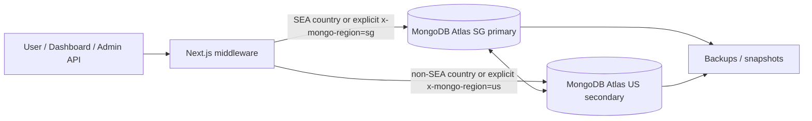

# Multi-Region MongoDB Runbook

**Scope:** FR-ADMIN-004 — Singapore primary MongoDB routing with a US-East secondary for read resilience.

## Architecture

## Routing rules

- `apps/web/src/middleware.ts` stamps `x-mongo-region` on dashboard and admin requests.
- `apps/web/src/server/db/mongo.ts` reads that header and defaults to SG when no request context exists.
- `GET /api/admin/health/db-regions` reports both regions and their latency / replica lag.
- `MONGO_URI_SG` is the primary runtime connection string.
- `MONGO_URI_US` is optional but required for full multi-region failover.
- `MONGODB_URI` remains a backward-compatible fallback during rollout.

## Failover procedure

1. Quiesce write traffic first.
  - Pause queue workers, scheduled jobs, and any admin workflows that create or update Mongo documents.
  - Leave read-only dashboard traffic running if the app is already routing reads to the healthy region.
2. Confirm the outage with `GET /api/admin/health/db-regions`.
  - SG should report `connected: false` or `status: primary-down`.
  - US should report `connected: true` and, if promoted, `status: primary-promoted`.
3. Promote the US-East node in MongoDB Atlas.
  - In Atlas, move the primary role to the US-East electable node.
  - If Atlas does not auto-promote, complete the replica-set reconfiguration before unpausing writes.
4. Cut over the runtime connection alias.
  - Rotate `MONGO_URI_SG` so it points to the promoted primary connection string.
  - Keep `MONGO_URI_US` on the secondary connection string for monitoring and rollback.
  - If the deployment uses a CNAME or SRV alias, repoint that DNS record to the promoted cluster before re-enabling writes.
  - Push the new secrets through the deployment secret manager or `vercel env` update path.
5. Verify the new primary before resuming write traffic.
  - Refresh `GET /api/admin/health/db-regions` until the promoted region is healthy.
  - Run one dashboard search, one history read, and one write path against the application.
  - Confirm the health payload reports the promoted region as active and the latency is back under the SLO.
6. Re-enable jobs and keep monitoring.
  - Resume workers and scheduled jobs only after the smoke tests pass.
  - Watch `primary-promoted`, `connected`, and `replica_lag_seconds` until the cluster stabilizes.

## Restore from backup

1. Open MongoDB Atlas backups for the SG cluster.
2. Restore the latest snapshot into a temporary cluster first.
3. Validate the restored data with a small product search and a single history query.
4. Promote the restored cluster only after the smoke checks pass.
5. Update connection strings in the deployment environment and recycle the app.

## Connection string rotation

1. Create or rotate the Atlas credential pair first.
2. Update `MONGO_URI_SG` and `MONGO_URI_US` in the deployment secret manager or Vercel env store.
3. Keep `MONGODB_URI` aligned with the currently active primary only while the transition is in flight.
4. Restart the web and API runtimes after the new secrets are live.
5. Confirm `GET /api/admin/health/db-regions` returns healthy status for both regions and the expected active primary.

## Monitoring checklist

- `GET /api/admin/health/db-regions` returns `sg.latency_ms` below the SLO target for the active region.
- `replica_lag_seconds` stays low and stable on the promoted secondary.
- PostHog event `db_failover_triggered` is emitted when SG becomes unavailable.
- Sentry / Better Stack alerts fire if both regions report `connected: false`.
- The dashboard still loads with no redirection loops after middleware adds `x-mongo-region`.

## Rollout notes

- Prefer a staged rollout: enable the SG/US URIs in staging first, then production.
- Keep the legacy `MONGODB_URI` available until the first post-deploy smoke test passes.
- Remove the legacy fallback only after the multi-region health route is green in production.
