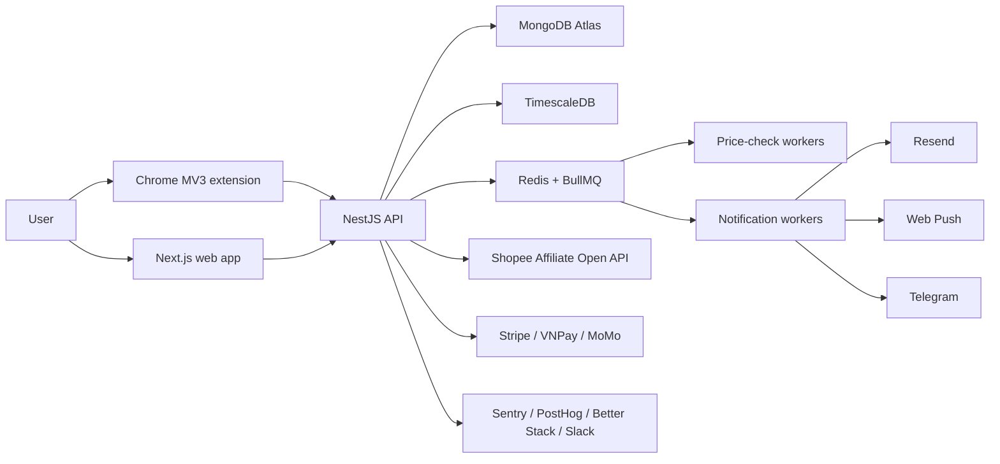

# SaleNoti Software Requirements Specification

**Version:** 1.0  
**Date:** 2026-05-18  
**Scope:** P0-P2 shipped implementation  
**Related docs:** `docs/product/PRD.md`, `docs/qa/TEST_PLAN.md`, `docs/qa/TEST_CASES.md`, `docs/qa/FR_TRACEABILITY.md`

---

## 1. System Overview

SaleNoti is a monorepo with three runtime products:

- `apps/web`: Next.js 15 App Router web application.
- `apps/api`: NestJS 10 API and worker fleet.
- `extension`: Chrome Manifest V3 extension.

The system integrates MongoDB Atlas, TimescaleDB/Neon Postgres, Upstash Redis, Shopee Affiliate Open API, Resend, Web Push, Telegram Bot API, Stripe, VNPay, MoMo, Sentry, PostHog, Better Stack, and Slack webhooks.

## 2. Architecture

## 3. Runtime Requirements

| Component | Requirement |
|---|---|
| Node | >= 24.0.0; `.nvmrc` pins `24.12.0` |
| Package manager | pnpm >= 11.0.0; root pins `pnpm@11.1.2` |
| Web dev port | `3000` |
| API dev port | `4000` by default via Nest |
| Extension output | `extension/dist` |
| Environment | `.env.example` documents all required keys; production values should come from Doppler or equivalent secret manager |

## 4. Security Requirements

- Access tokens expire after 15 minutes.
- Refresh tokens expire after 30 days and are stored in HTTP-only cookies.
- Refresh token family is revoked on reuse detection.
- PII fields that must not be plaintext: B2B email, B2B phone, source IP, user agent where stored for lead auditing.
- `DATA_ENCRYPTION_KEY` must be a 32-byte hex value.
- `PII_HASH_SALT` and product/referral salts must be non-empty secrets.
- Webhook endpoints must verify provider signatures/secrets before mutating state.
- Rate limits must be enforced for public auth, lead, affiliate, search, and notification endpoints.
- Extension must not request `<all_urls>` and must not call Shopee cart/internal APIs.

## 5. API Requirements

### 5.1 Authentication Web Routes

| Endpoint | Method | Owner | Requirement |
|---|---|---|---|
| `/api/auth/[...nextauth]` | GET/POST | Web | Auth.js handlers for Google OAuth |
| `/api/auth/magic-link/issue` | POST | Web | Issue 15-minute token via Resend-safe email path |
| `/api/auth/magic-link/consume` | GET | Web | Consume one-time token and create session |
| `/api/auth/refresh` | POST | Web | Rotate refresh token and emit new access cookie |
| `/api/auth/sign-out` | POST | Web | Clear session cookies |
| `/api/auth/sessions` | GET/DELETE | Web | Inspect/revoke session family |

### 5.2 Public Web Support Routes

| Endpoint | Method | Requirement |
|---|---|---|
| `/api/health` | GET | Returns web health JSON |
| `/api/business/lead` | POST | Forwards business lead to API public lead endpoint |
| `/api/me/push/subscribe` | POST | Store VAPID subscription after explicit user action |
| `/api/me/push/unsubscribe` | POST | Remove subscription |
| `/api/me/push/clicked` | POST | Record push click telemetry |
| `/api/me/telegram/link-token` | GET | Create Telegram link token |
| `/api/share/click` | GET | Register share click telemetry |
| `/r/:refCode` | GET | Referral redirect route |

### 5.3 API Service Routes

| Endpoint | Method | Requirement | FR |
|---|---|---|---|
| `/health` | GET | API health | FR-OBS-001 |
| `/health/queue` | GET | Queue/Redis health | FR-WORKER-001 |
| `/v1/products/track` | POST | Track Shopee URL and create watchlist | FR-WATCH-001 |
| `/v1/products/search` | GET | Cached product search with sanitized response | FR-AFF-004 |
| `/v1/products/:productId/history` | GET | Chart-ready time-series | FR-PRICE-002 |
| `/v1/watchlists` | GET | List watchlists | FR-WATCH-003 |
| `/v1/watchlists/:id` | PATCH | Update trigger config/pause/resume | FR-WATCH-002/003 |
| `/v1/watchlists/:id` | DELETE | Soft-delete watchlist | FR-WATCH-003 |
| `/v1/affiliate/deeplink` | POST | Generate disclosed, attributed deeplink | FR-AFF-002 |
| `/v1/billing/subscribe` | POST | Create checkout/redirect URL | FR-BILL-001 |
| `/webhooks/stripe` | POST | Stripe lifecycle webhook | FR-BILL-001 |
| `/webhooks/vnpay` | POST | VNPay lifecycle webhook | FR-BILL-001 |
| `/webhooks/momo` | POST | MoMo lifecycle webhook | FR-BILL-001 |
| `/webhooks/resend` | POST | Email delivery/bounce/complaint webhook | FR-NOTIF-001 |
| `/webhooks/telegram` | POST | Telegram link and inbound webhook | FR-NOTIF-003 |
| `/v1/me/referral` | GET | Read referral status/code | FR-GROW-001 |
| `/v1/share` | POST | Create share deal link | FR-GROW-002 |
| `/v1/megasale` | GET | Active/upcoming Mega Sale config | FR-GROW-003 |
| `/v1/business/lead` | POST | B2B lead capture | FR-ADMIN-001 |
| `/api/public/b2b-contact` | POST | Public B2B lead alias for web form | FR-ADMIN-001 |
| `/v1/legal/dsr/export` | POST | DSR export | FR-LEGAL-001 |
| `/v1/legal/dsr/delete` | POST | DSR delete/tombstone | FR-LEGAL-001 |

## 6. Data Requirements

### 6.1 MongoDB Collections

| Collection | Purpose | Key fields |
|---|---|---|
| `users` | Auth profile, plan, referral, Telegram/push linkage | `_id`, `email`, `plan`, `refCode`, `telegramChatId` |
| `products` | Product metadata from Shopee Affiliate API | `shopId`, `itemId`, `name`, `price`, `commissionRate`, `trackPriority` |
| `watchlists` | User-product tracking config | `userId`, `productId`, `status`, `alertConfig`, `triggerCooldowns`, `deletedAt` |
| `affiliate_links` | Deeplink attribution and cache | `userId`, `productId`, `source`, `campaign`, `subIds`, `shortUrl`, `cacheHits` |
| `notifications` | Alert send audit | `idemKey`, `userId`, `watchlistId`, `channel`, `status`, `providerMessageId` |
| `push_subscriptions` | Web push endpoints | `userId`, `endpoint`, `p256dh`, `auth`, `lastSeenAt` |
| `telegram_links` | Telegram link-token flow | `userId`, `tokenHash`, `chatId`, `expiresAt` |
| `subscriptions` | Billing state | `userId`, `plan`, `interval`, `provider`, `status`, `currentPeriodEnd` |
| `referrals` | Referral qualification and rewards | `referrerId`, `inviteeId`, `status`, `qualifiedAt` |
| `share_deals` | Public share landing pages | `slug`, `userId`, `productId`, `deeplink`, `expiresAt` |
| `b2b_leads` | Seller/brand lead capture | `companyName`, `contactName`, encrypted PII envelopes, hashes, consent |

### 6.2 TimescaleDB Tables

| Table/View | Purpose |
|---|---|
| `price_history` | Raw product observations, hypertable |
| `price_history_30m` | Continuous aggregate for chart and lowest_30d checks |
| Retention policies | Raw 30/90 day operational windows and longer aggregate storage per FR |

### 6.3 Redis Keys

| Prefix | Purpose |
|---|---|
| `bull:*` | BullMQ queue state |
| `product_search:*` | Product search cache |
| `deeplink:*` | Deeplink cache and SET NX lease |
| `idem:*` | Notification idempotency |
| `rl:*` | Fixed-window rate limits |
| `telegram_link:*` | Telegram link tokens |
| `price_check:*` | Scheduler/worker coordination |

## 7. Worker Requirements

| Worker | Queue | Requirement |
|---|---|---|
| Price check | `price-check` | Resolve current Shopee product offer, write price history, evaluate triggers |
| Email alert | `alert-dispatch` | Render disclosure-compliant alert email and send through Resend |
| Push alert | `alert-dispatch` | Send VAPID push and handle expired subscriptions |
| Telegram alert | `alert-dispatch` | Send Telegram Bot API message with inline deeplink |
| Commission reconcile | `commission-reconcile` | Reconcile affiliate conversion lifecycle |
| Housekeeping | `housekeeping` | Cleanup expired tokens, old audit rows, stale subscriptions |
| Grace period | Scheduler cron | Transition subscription states after payment grace windows |

## 8. Web UI Requirements

| Page | Requirement |
|---|---|
| `/` | Landing page with product value, disclosure, and call to action |
| `/auth/sign-in` | Google OAuth and magic-link sign-in form |
| `/dashboard` | Protected route; anonymous users redirect to sign-in |
| `/privacy` | Privacy policy surface |
| `/legal/affiliate` | Affiliate disclosure and transparency explanation |
| `/legal/cross-border-transfer-impact-assessment` | Cross-border disclosure |
| `/transparency` and `/transparency/:quarter` | Affiliate transparency report |
| `/business` | B2B lead form with PDPL consent |
| `/deal/:slug` | Share-deal landing page with OpenGraph metadata and disclosure |
| `/megasale/:slug` | Mega Sale event page |

## 9. Extension Requirements

- Manifest version must be 3.
- Host permissions must be limited to Shopee VN, not `<all_urls>`.
- Content script must render a user-initiated "+ Theo dõi giá" button on product URLs.
- User must acknowledge affiliate disclosure before tracking.
- Background script must bridge auth/API calls without scraping cart/private endpoints.
- Options and popup surfaces must expose account/status controls.
- Icons must exist for Chrome Web Store packaging.

## 10. Observability Requirements

- Sentry captures API and web exceptions with PII redaction.
- PostHog captures product funnel events without raw PII.
- Better Stack monitors uptime endpoints.
- Slack webhook emits operational notifications with redacted payloads.
- Bull Board is protected by basic auth.
- Queue health endpoint reports Redis/BullMQ status.

## 11. Test Requirements

| Layer | Required command | Coverage intent |
|---|---|---|
| Static FR/legal | `pnpm fr:check`, `pnpm legal:check` | FR frontmatter/audit sync, disclosure and ethics gates |
| Types | `pnpm typecheck` | All packages compile under strict TypeScript |
| Lint | `pnpm lint` | ESLint policy checks |
| Unit | `pnpm test` | Domain services, crypto, schedulers, auth, extension manifest |
| End-to-end | `pnpm test:e2e` | Public web smoke, B2B API flow, extension manifest installability checks |
| Build | `pnpm build` | Production web/API/extension build |
| Browser | Manual/automated browser smoke | Public pages, auth redirect, business form |

## 12. Acceptance Exit Criteria

The implementation is acceptable when:

1. Every P0-P2 FR in `docs/feature-requests/BACKLOG.md` has a deliverable mapped in `docs/qa/FR_TRACEABILITY.md`.
2. Every P0-P2 FR has at least one static, unit, e2e, integration, live-browser, or manual verification case in `docs/qa/TEST_CASES.md`.
3. The root verification suite passes except documented external-provider skips.
4. Any blocked live-provider checks are explicitly named with required credentials.
5. `README.md` can guide a new engineer from clone to local run, audit, tuning, and deployment.
